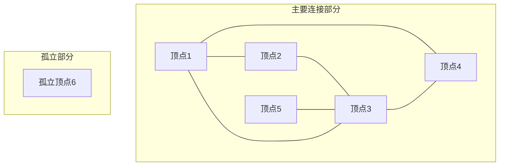

这是一种图表示方法，**度数（Degree）** 是指一个顶点连接的边的数量，其核心思想就是只关心 **"有多少"**，不关心 **"具体是谁"**

```python
def basic_degree_count(N, edges):
    """
    N: 顶点数量（顶点编号从1到N）
    edges: 边的列表，每个元素是(a,b)
    返回：度数数组，degree[i]表示顶点i的度数
    """
    degree = [0] * (N + 1)  # 创建N+1大小的数组，索引0不使用
    
    for a, b in edges:
        degree[a] += 1  # a的度数加1
        degree[b] += 1  # b的度数加1
    
    return degree
```
这是最基础的度数统计

我们举个例子:（冲突关系）

研究人员有 N 人，编号为 1,2,…,N 。
研究者之间存在利益冲突；对于 i=1,2,…,M ，研究者 Ai​ 和 Bi 之间存在利益冲突。
一篇论文的审稿人必须是三个不同的研究人员，他们与论文的作者不同，并且与作者没有利益冲突。
对于 i=1,2,…,Ni=1,2,…,N ，求解如下问题：
-找出研究人员 i 撰写的论文可能的审稿人数目。

==即有N个点，M条线，每一条线串联两个点，证明这两个研究者有利益冲突，不能审稿==

如果不用度数统计
```python
N, M = map(int, input().split())  
conflict_list = []  
for i in range(M):  
    x, y = map(int, input().split())  
    conflict_list.append((x, y))  
result_list=[]  
for k in range(1, N+1):  
    N_temp = N  
    temp_list=[]  
    for i in range(M):  
        if conflict_list[i][0] == k and conflict_list[i][1] not in temp_list:  
            temp_list.append(conflict_list[i][1])  
        elif conflict_list[i][1] == k and conflict_list[i][0] not in temp_list:  
            temp_list.append(conflict_list[i][0])  
    N_temp = N_temp - len(temp_list) - 1  
    if N_temp < 3:  
        result_list.append(0)  
    else:  
        result = N_temp*(N_temp-1)*(N_temp-2) // 6  
        result_list.append(result)  
  
print(*result_list)
```
这是一种非常耗时间的方法，通过不断的遍历来判断，最后用组合数得出结果
****
如果用度数统计的话（这个题目的关键就是你不需要知道几号和你冲突，你只需要知道几个人就可以得出结果）

```python
N, M = map(int, input().split())  
conflict_count = [0] * (N + 1)  # 索引0并不使用
  
# 读取时同时计数  
for i in range(M):  
    x, y = map(int, input().split())  
    conflict_count[x] += 1  
    conflict_count[y] += 1  
  
result_list = []  
for k in range(1, N+1):  
    available = N - 1 - conflict_count[k]  
    if available < 3:  
        result_list.append(0)  
    else:  
        result = available * (available-1) * (available-2) // 6  
        result_list.append(result)  
  
print(*result_list)
```

比如，1号的度数是`conflict_count[1]`，即和1号有利益冲突的人有这些，没有利益冲突的就是总数减去有利益冲突的再减去1号自己，这些人选3个出来审稿，就可以了

```input
6 5
1 2
1 4
2 3
5 3
3 1
```

下面的图就是上面图论的表示方法，请忽略箭头，这是一个**无向图**



因此，1号有三个度，所有与他有冲突的有三个人，共6个人，能审稿的只有两个，所以输出0