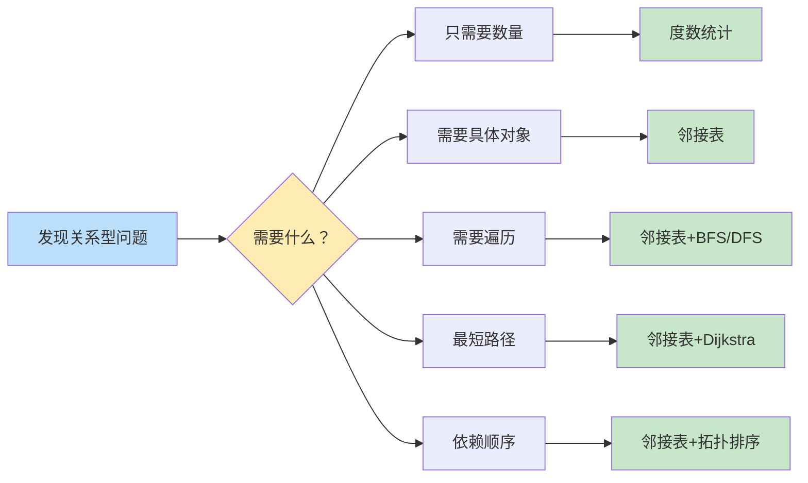

	1. 识别"关系" → 2. 判定为图论问题 → 3. 选择合适的方法
## 一、如何识别"关系"型问题

### 常见的关键词/场景：

- **人与人**：朋友、敌人、冲突、合作、关注
    
- **地点之间**：道路、航线、连接、通路
    
- **事物之间**：依赖、关联、影响、制约
    
- **状态之间**：转换、转移、可达性
    

### 具体例子：

1. **"A和B是朋友"** → 图论（社交网络）
    
2. **"从城市X到城市Y有路"** → 图论（交通网络）
    
3. **"任务A必须在任务B之前完成"** → 图论（依赖关系）
    
4. **"两个研究人员有冲突"** → 图论（冲突关系）← 你的审稿人问题

这些都是图论问题

