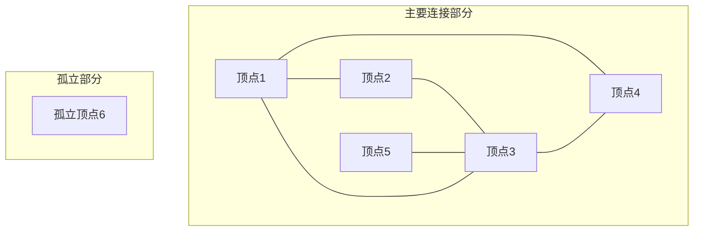

也是一种图表示方法，如果度数统计是不关心谁，邻接表就是关心度连接的谁

基本的构造方式如图
```python
def build_adjacency_list(N, edges):
    """
    构建无向图的邻接表
    N: 顶点数量（编号1到N）
    edges: 边的列表，如 [(1,2), (1,3), (2,4), (3,4)]
    返回: 邻接表
    """
    adj = [[] for _ in range(N + 1)]
    
    for a, b in edges:
        # 无向图：边要存两次
        adj[a].append(b)
        adj[b].append(a)
    
    return adj
```

我们还是拿度数统计的例子：
研究人员有 N 人，编号为 1,2,…,N 。
研究者之间存在利益冲突；对于 i=1,2,…,M ，研究者 Ai​ 和 Bi 之间存在利益冲突。
一篇论文的审稿人必须是三个不同的研究人员，他们与论文的作者不同，并且与作者没有利益冲突。
对于 i=1,2,…,Ni=1,2,…,N ，求解如下问题：
-找出研究人员 i 撰写的论文可能的审稿人数目。

==即有N个点，M条线，每一条线串联两个点，证明这两个研究者有利益冲突，不能审稿==

```python
N, M = map(int, input().split())

# 创建邻接表
adj = [[] for _ in range(N + 1)]

# 读取冲突关系，构建邻接表
for _ in range(M):
    x, y = map(int, input().split())
    adj[x].append(y)
    adj[y].append(x)

result_list = []
for k in range(1, N + 1):
    # 从邻接表获取冲突人数：adj[k]的长度
    conflict_num = len(adj[k])  # 原来 conflict_count[k] 的地方
    
    available = N - 1 - conflict_num  # N-1-冲突人数
    
    if available < 3:
        result_list.append(0)
    else:
        result = available * (available - 1) * (available - 2) // 6
        result_list.append(result)

print(*result_list)
```

邻接表其实就是列表套列表，`[[][][][]]`
其中大列表是有N个人，小列表里面放的是与这个人冲突的人是谁，有几个人冲突拿len函数就可以拿到这个关系


下面的图就是上面图论的表示方法，请忽略箭头，这是一个**无向图**



因此，1号有三个度，所有与他有冲突的有三个人，共6个人，能审稿的只有两个，所以输出0，并且`print(*adj[1])`就可以拿到`2 3 4` 与 1 冲突